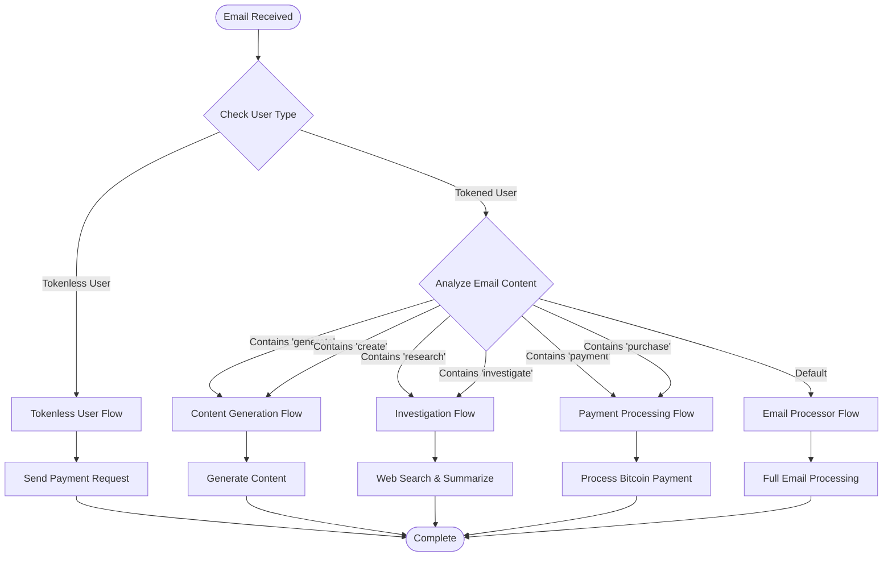
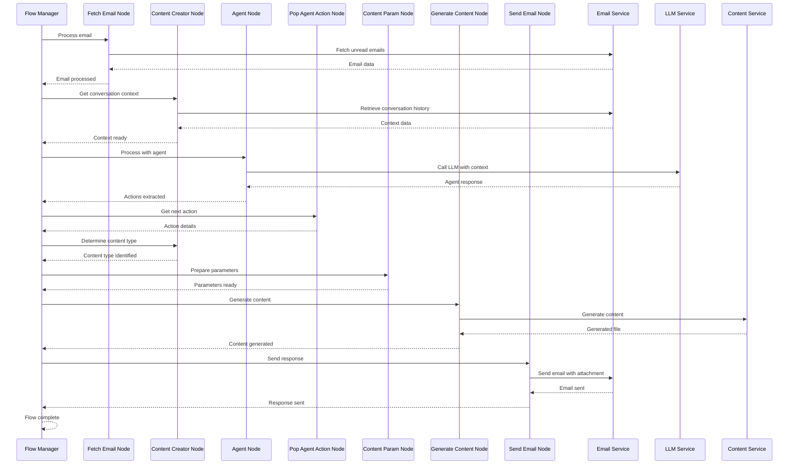
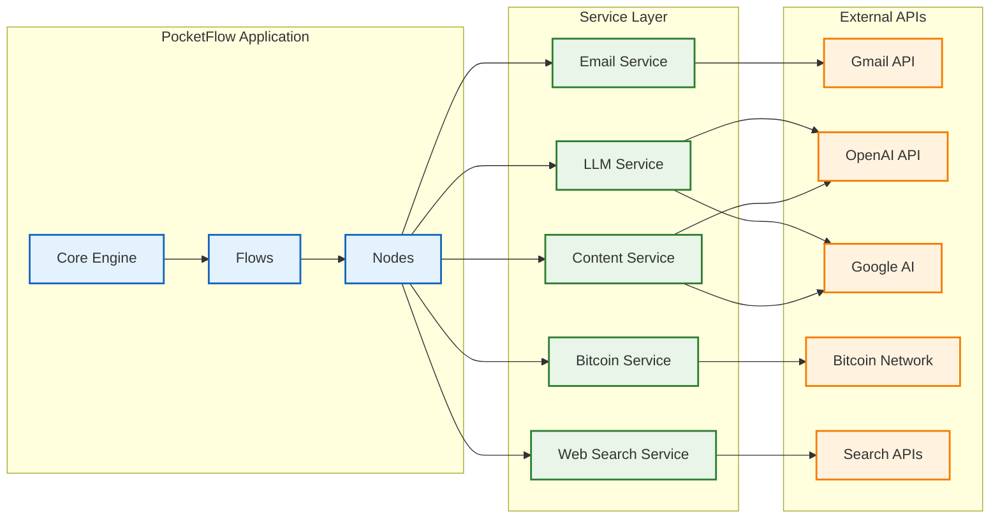
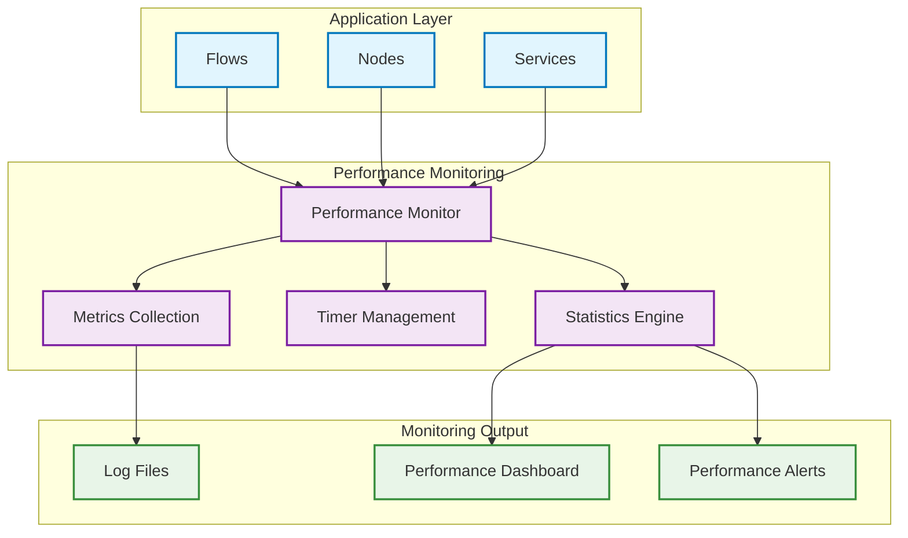
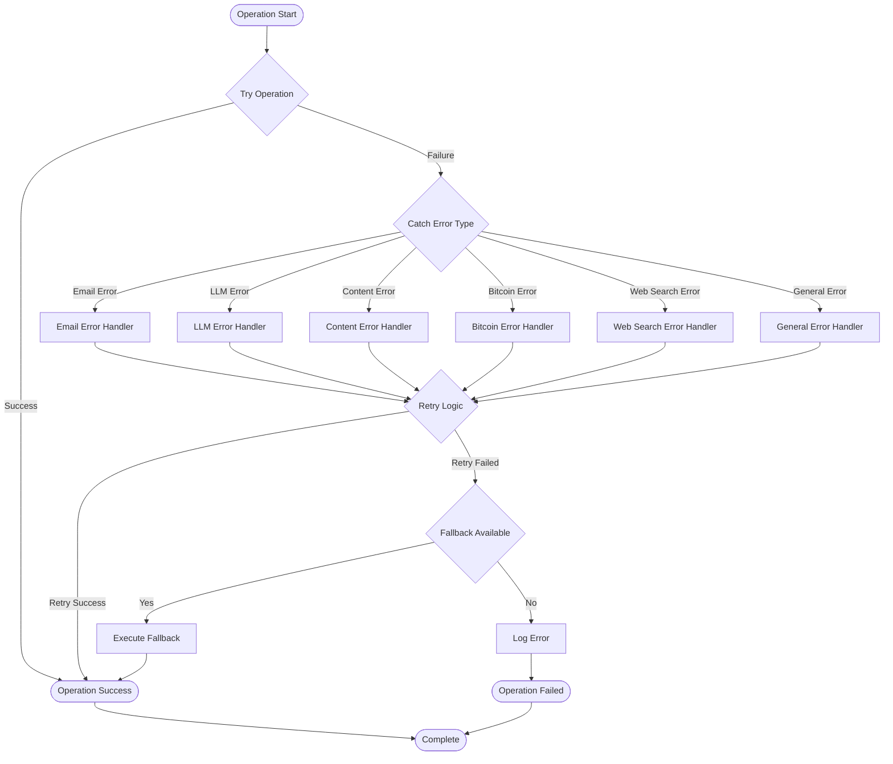
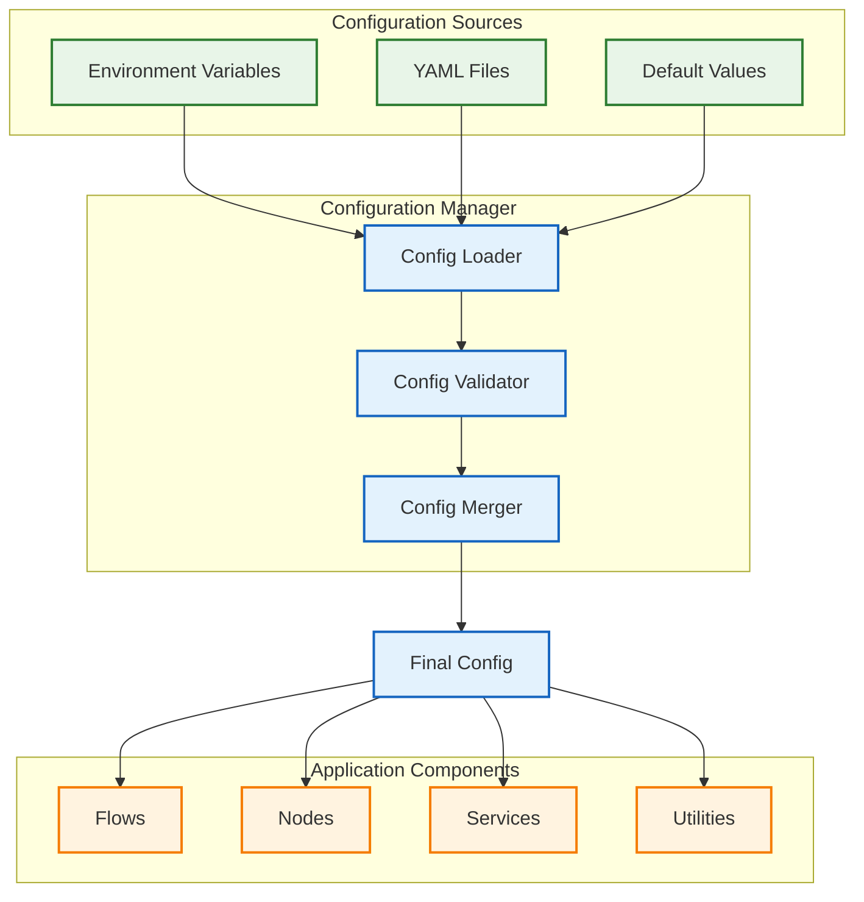
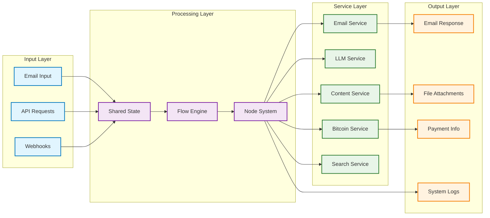
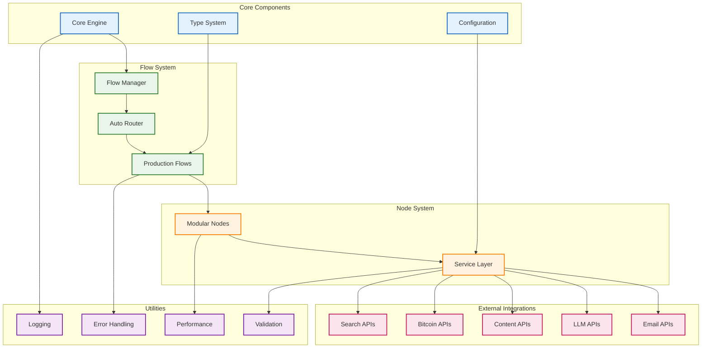

# PocketFlow Architecture Diagram

## Complete System Architecture

```mermaid
graph TB
    %% User Interface Layer
    subgraph "User Interface"
        UI[Email Client]
        API[API Endpoints]
    end

    %% Main Application Layer
    subgraph "PocketFlow Core"
        FM[Flow Manager]
        AR[Auto Router]
        PM[Performance Monitor]
    end

    %% Flow Layer
    subgraph "Flow Engine"
        EPF[Email Processor Flow]
        TUF[Tokenless User Flow]
        CGF[Content Generation Flow]
        IF[Investigation Flow]
        PPF[Payment Processing Flow]
    end

    %% Node Layer
    subgraph "Node System"
        subgraph "Email Nodes"
            FEN[Fetch Email Node]
            SEN[Send Email Node]
            CCN[Conversation Context Node]
        end
        
        subgraph "Agent Nodes"
            AN[Agent Node]
            PAN[Pop Agent Action Node]
        end
        
        subgraph "Content Nodes"
            CCN[Content Creator Node]
            CPN[Content Param Node]
            GCN[Generate Content Node]
        end
        
        subgraph "Investigation Nodes"
            ITN[Investigate Topic Node]
        end
        
        subgraph "Bitcoin Nodes"
            PTBN[Purchase Tokens Bitcoin Node]
        end
    end

    %% Service Layer
    subgraph "Service Layer"
        ES[Email Service]
        LS[LLM Service]
        CS[Content Service]
        BS[Bitcoin Service]
        WS[Web Search Service]
    end

    %% External Services
    subgraph "External Services"
        GMAIL[Gmail IMAP/SMTP]
        OPENAI[OpenAI API]
        GOOGLE[Google AI]
        BTC[Bitcoin Network]
        WEB[Web Search APIs]
    end

    %% Configuration & Utils
    subgraph "Configuration & Utils"
        CONFIG[Configuration Manager]
        LOG[Logging System]
        ERR[Error Handler]
        VAL[Validation]
        PERF[Performance Monitor]
    end

    %% Data Flow
    UI --> FM
    API --> FM
    
    FM --> AR
    AR --> EPF
    AR --> TUF
    AR --> CGF
    AR --> IF
    AR --> PPF
    
    EPF --> FEN
    EPF --> SEN
    EPF --> CCN
    EPF --> AN
    EPF --> PAN
    EPF --> CCN
    EPF --> CPN
    EPF --> GCN
    EPF --> ITN
    
    TUF --> PTBN
    TUF --> SEN
    
    CGF --> CCN
    CGF --> CPN
    CGF --> GCN
    CGF --> SEN
    
    IF --> ITN
    IF --> SEN
    
    PPF --> PTBN
    PPF --> SEN
    
    %% Node to Service connections
    FEN --> ES
    SEN --> ES
    CCN --> ES
    AN --> LS
    PAN --> LS
    CCN --> CS
    CPN --> CS
    GCN --> CS
    ITN --> WS
    PTBN --> BS
    
    %% Service to External connections
    ES --> GMAIL
    LS --> OPENAI
    LS --> GOOGLE
    CS --> OPENAI
    CS --> GOOGLE
    BS --> BTC
    WS --> WEB
    
    %% Configuration connections
    FM --> CONFIG
    ES --> CONFIG
    LS --> CONFIG
    CS --> CONFIG
    BS --> CONFIG
    WS --> CONFIG
    
    %% Monitoring connections
    FM --> PM
    EPF --> PERF
    TUF --> PERF
    CGF --> PERF
    IF --> PERF
    PPF --> PERF
    
    %% Error handling
    FM --> ERR
    EPF --> ERR
    TUF --> ERR
    CGF --> ERR
    IF --> ERR
    PPF --> ERR
    
    %% Logging
    FM --> LOG
    EPF --> LOG
    TUF --> LOG
    CGF --> LOG
    IF --> LOG
    PPF --> LOG

    %% Styling
    classDef flowClass fill:#e1f5fe,stroke:#01579b,stroke-width:2px
    classDef nodeClass fill:#f3e5f5,stroke:#4a148c,stroke-width:2px
    classDef serviceClass fill:#e8f5e8,stroke:#1b5e20,stroke-width:2px
    classDef externalClass fill:#fff3e0,stroke:#e65100,stroke-width:2px
    classDef utilClass fill:#fce4ec,stroke:#880e4f,stroke-width:2px
    
    class EPF,TUF,CGF,IF,PPF flowClass
    class FEN,SEN,CCN,AN,PAN,CCN,CPN,GCN,ITN,PTBN nodeClass
    class ES,LS,CS,BS,WS serviceClass
    class GMAIL,OPENAI,GOOGLE,BTC,WEB externalClass
    class CONFIG,LOG,ERR,VAL,PERF utilClass
```

## Flow Selection Logic

## Node Processing Pipeline

## Service Integration Architecture

## Performance Monitoring Architecture

## Error Handling Flow

## Configuration Management

## Data Flow Architecture

## Component Relationships

This comprehensive set of Mermaid diagrams shows the complete PocketFlow architecture after the refactor, including:

1. **Complete System Architecture** - Overall system structure
2. **Flow Selection Logic** - How flows are automatically selected
3. **Node Processing Pipeline** - Sequence of node execution
4. **Service Integration Architecture** - How services connect to external APIs
5. **Performance Monitoring Architecture** - How performance is tracked
6. **Error Handling Flow** - Error handling and recovery
7. **Configuration Management** - How configuration is managed
8. **Data Flow Architecture** - How data flows through the system
9. **Component Relationships** - How all components relate to each other

The diagrams illustrate the modular, scalable, and production-ready architecture that has been achieved through the refactor! 