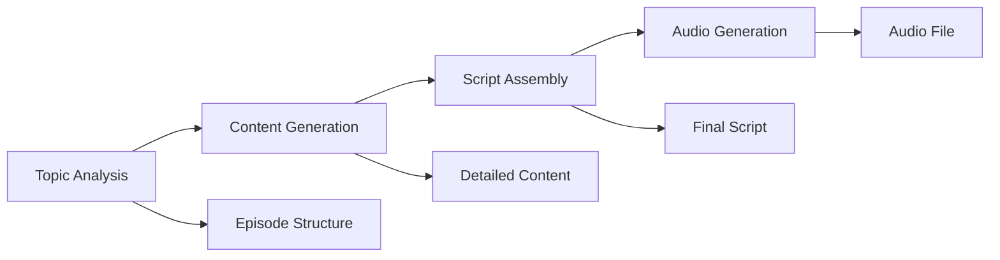

# Podcastify Integration with PocketFlow

This document describes the integration of Podcastify with your PocketFlow project, enabling automated podcast generation using local AI components.

## 🎯 Overview

The integration provides a complete podcast generation workflow using PocketFlow's Node and Flow abstractions:

- **Topic Analysis**: Analyzes podcast topics and creates episode structure
- **Content Generation**: Generates detailed content for each theme
- **Script Assembly**: Assembles the final podcast script
- **Audio Generation**: Converts script to audio using Bark TTS

## 📋 Prerequisites

1. **Ollama**: Local LLM server with llama3 model
   ```bash
   ollama serve
   ollama pull llama3
   ```

2. **Python Dependencies**: Core components installed
   ```bash
   pip install langchain-ollama ollama suno-bark torch soundfile
   ```

## 🚀 Quick Start

### 1. Test the Integration

Run the test script to verify everything is working:

```bash
python test_podcastify_integration.py
```

Expected output:
```
🎯 4/4 tests passed
🎉 All tests passed! Podcastify is ready to use in PocketFlow!
```

### 2. Generate a Podcast

Run the main workflow to generate a complete podcast:

```bash
python podcastify_workflow.py
```

This will:
- Analyze the topic "The Future of Artificial Intelligence"
- Generate episode structure and content
- Create a complete script
- Generate audio using Bark TTS
- Save outputs to `generated_script.md` and `output/generated_podcast.wav`

## 🏗️ Architecture

### PocketFlow Workflow



### Node Structure

Each node follows PocketFlow's `prep -> exec -> post` pattern:

1. **TopicAnalysisNode**: Analyzes topic and creates episode structure
2. **ContentGenerationNode**: Generates detailed content for each theme
3. **ScriptAssemblyNode**: Assembles the final podcast script
4. **AudioGenerationNode**: Converts script to audio using Bark TTS

## ⚙️ Configuration

Customize the podcast generation by modifying the `PodcastConfig`:

```python
config = PodcastConfig(
    topic="Your Topic Here",
    duration_minutes=15,
    style="conversational",
    language="en",
    voice="en-US-Neural2-F",
    output_dir="output",
    llm_model="llama3:latest"
)
```

## 📁 Output Files

- `generated_script.md`: Complete podcast script in Markdown format
- `output/generated_podcast.wav`: Generated audio file

## 🔧 Customization

### Adding New Nodes

Extend the workflow by creating new nodes:

```python
class CustomNode(Node):
    def prep(self, shared):
        return shared.get("data")
    
    def exec(self, data):
        # Your custom logic here
        return processed_data
    
    def post(self, shared, prep_res, exec_res):
        shared["result"] = exec_res
        return "default"
```

### Modifying the Flow

Add branching or conditional logic:

```python
# Add conditional branching
topic_analysis - "needs_research" >> research_node >> content_generation
topic_analysis - "ready" >> content_generation
```

## 🐛 Troubleshooting

### Common Issues

1. **Ollama Connection Failed**
   - Ensure Ollama is running: `ollama serve`
   - Check if llama3 model is available: `ollama list`

2. **Bark TTS Errors**
   - Force CPU mode for Bark (already configured)
   - Check PyTorch installation

3. **Memory Issues**
   - Reduce sentence limit in AudioGenerationNode
   - Use smaller LLM models

### Debug Mode

Enable detailed logging by modifying the workflow:

```python
# Add logging to nodes
import logging
logging.basicConfig(level=logging.DEBUG)
```

## 🔗 Integration with Existing PocketFlow

The podcast workflow can be integrated with your existing PocketFlow applications:

```python
# Import the workflow
from podcastify_workflow import PodcastWorkflow, PodcastConfig

# Use in your existing flow
config = PodcastConfig(topic="Your Topic")
workflow = PodcastWorkflow(config)
result = workflow.generate_podcast()
```

## 📚 Next Steps

1. **Customize Prompts**: Modify the prompts in each node for your specific use case
2. **Add Error Handling**: Implement retry logic and fallback mechanisms
3. **Optimize Performance**: Add caching and parallel processing
4. **Extend Features**: Add support for multiple voices, music, or different TTS providers

## 🤝 Contributing

To extend the integration:

1. Create new nodes for additional functionality
2. Modify existing nodes to improve quality
3. Add new workflow patterns (branching, loops, etc.)
4. Integrate with other PocketFlow components

## 📄 License

This integration follows the same license as your PocketFlow project.

---

**Happy Podcasting with PocketFlow! 🎙️** 